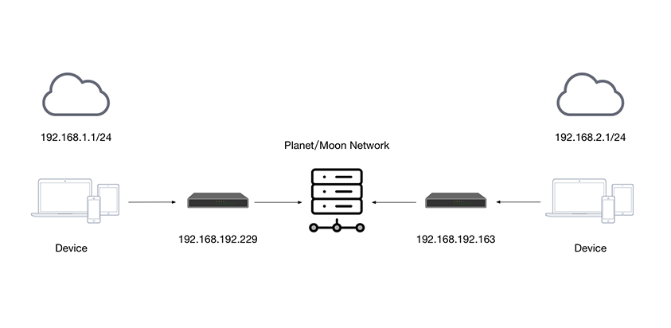
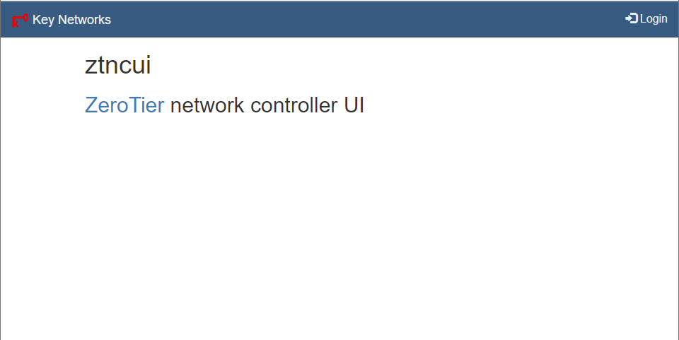
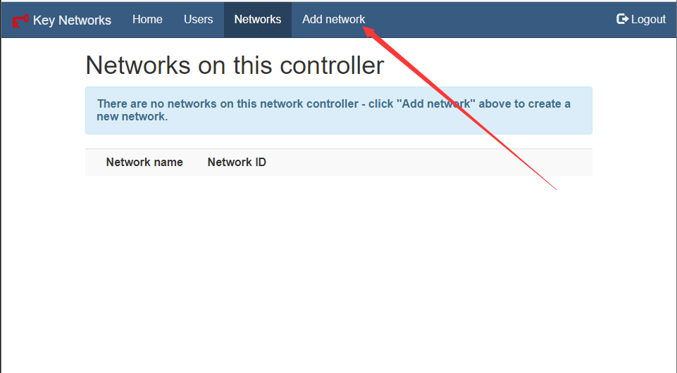
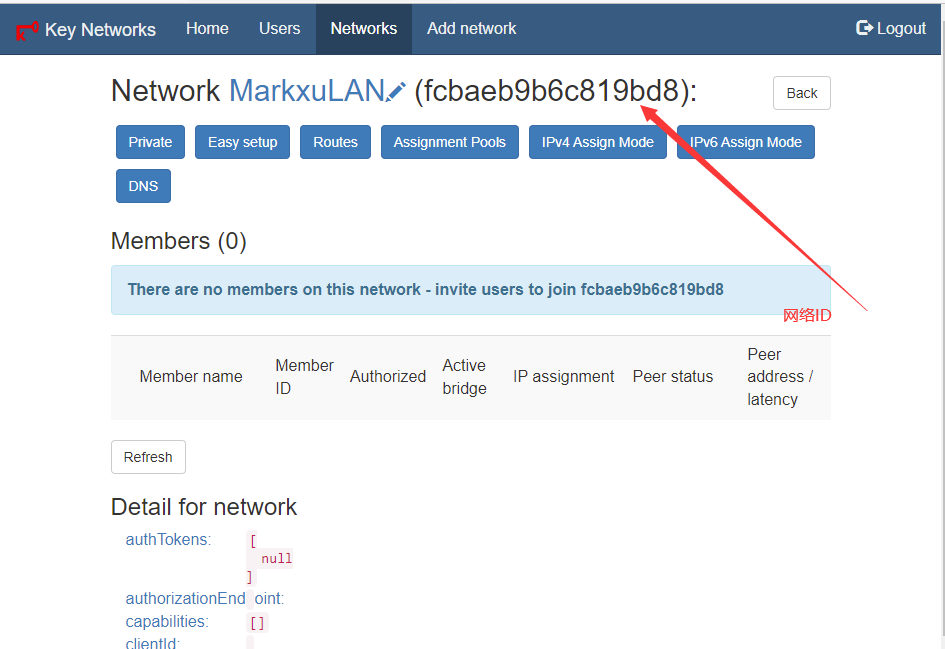
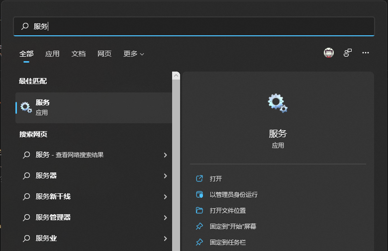
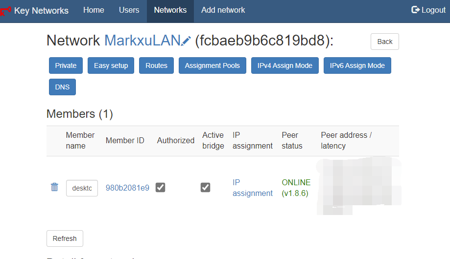

 本项目的 CDN 加速和安全保护由腾讯 EdgeOne 赞助

# 交流群

**Telegram**
- TG交流群：https://t.me/+JduuWfhSEPdlNDk1

**QQ Group**
- 1群：692635772 
- 2群：785620313
- 3群：316239544
- 4群：1027678459

# 微信公众号


# 功能特性
- ✅ 支持 Linux/AMD64、Linux/ARM64 架构
- 🐳 Docker 容器化部署
- 📥 支持 URL 下载 planet、moon 配置
- 🌐 可作为 Moon 或 Planet 服务器搭建

# 目录
- [0: 广告](#0-广告)
- [1：ZeroTier 介绍](#1zerotier-介绍)
- [2：为什么要自建PLANET 服务器](#2为什么要自建planet-服务器)
- [3：开始安装](#3开始安装)
  - [3.1：准备条件](#31准备条件)
    - [3.1.1 安装git](#311-安装git)
    - [3.1.2 安装docker](#312-安装docker)
    - [3.1.3 启动docker](#313-启动docker)
    - [3.1.4 配置docker加速镜像（可选，不配也可以）](#314-配置docker加速镜像可选不配也可以)
  - [3.2：下载项目源码](#32下载项目源码)
  - [3.3：执行安装脚本](#33执行安装脚本)
  - [3.4 下载 `planet` 文件](#34-下载-planet-文件)
  - [3.5 新建网络](#35-新建网络)
    - [3.5.1 创建网络](#351-创建网络)
    - [3.5.2 分配网络IP:](#352-分配网络ip)
- [4.客户端配置](#4客户端配置)
  - [4.1 Windows 配置](#41-windows-配置)
    - [4.2 加入网络](#42-加入网络)
  - [4.2 Linux 客户端](#42-linux-客户端)
  - [4.3 安卓客户端配置](#43-安卓客户端配置)
  - [4.4 MacOS 客户端配置](#44-macos-客户端配置)
  - [4.5 OpenWRT 客户端配置](#45-openwrt-客户端配置)
- [参考链接](#参考链接)
- [5. 管理面板SSL配置](#5-管理面板ssl配置)
- [6. 卸载](#6-卸载)
- [7: Q\&A：](#7-qa)
  - [1. 为什么我ping不通目标机器？](#1-为什么我ping不通目标机器)
  - [2. IOS客户端怎么用？](#2-ios客户端怎么用)
  - [3. 为什么看不到官方的Planet](#3-为什么看不到官方的planet)
  - [4. 我更换了IP需要怎么处理？](#4-我更换了ip需要怎么处理)
  - [5. PVE lxc 容器没有创建网卡](#5-pve-lxc-容器没有创建网卡)
  - [6. 管理后台忘记密码怎么办：](#6-管理后台忘记密码怎么办)
  - [7. 为什么连不上planet](#7-为什么连不上planet)
  - [8. 如何判断是直连还是中转](#8-如何判断是直连还是中转)
  - [9. 为什么我的zerotier传输不稳定](#9-为什么我的zerotier传输不稳定)
  - [10.支持域名吗？](#10支持域名吗)
  - [11. ARM服务器可以搭建吗](#11-arm服务器可以搭建吗)
  - [12. 支持docker-compose启动部署吗](#12-支持docker-compose启动部署吗)
- [开发计划](#开发计划)
- [风险声明](#风险声明)
- [类似项目](#类似项目)
- [捐助和支持](#捐助和支持)
- [鸣谢](#鸣谢)

# 0: 广告
## 托管方案一：自运营容器服务
**寻找便捷的解决方案？**

我们提供专业的托管服务：
- 免费试用3天
- 年费仅需99￥
- 高速带宽：300Mbit
- 流量政策：
  - 每月100G转发流量
  - P2P连接后不计流量
  - 超出后每10元100G
- 优质线路：宁波电信机房
- 联系方式：
  - Telegram：[https://t.me/uxkram](https://t.me/uxkram)
  - 或加入QQ群咨询群主

测速图如下：


## 0.2 托管方案二：雨云容器服务
[](https://app.rainyun.com/apps/rca/store/6215?ref=220429)


### 0.3 微信公众号广告：欢迎关注公众号获取最新动态和技术分享


# 1：ZeroTier 介绍

`ZeroTier` 是一款强大的 P2P VPN 工具，它能让你在互联网上搭建属于自己的虚拟局域网。通过它，你可以轻松实现远程访问家中设备的需求 - 比如在公司用手机直接访问家里的 NAS。最重要的是，设备之间是点对点直连的，无需经过中转服务器，既保证了速度，又提升了安全性。

它的工作原理是这样的：通过 `ZeroTier One` 客户端，在不同设备（如笔记本、手机、服务器等）之间建立 P2P 连接，即使这些设备都在 NAT 后面也没问题。它使用了 STUN 等技术，可以穿透大多数类型的 NAT，实现设备间的直接通信。如果实在无法直连，才会通过中转服务器进行通信。

简单来说，`ZeroTier` 就像是一个跨越互联网的"虚拟交换机"，让分布在世界各地的设备，都能像在同一个局域网内一样方便地相互访问。



**ZeroTier 网络中的关键概念**

`PLANET`（行星服务器）：ZeroTier 网络的核心根服务器，负责网络发现和初始连接。相当于整个网络的"中枢"。

`MOON`（卫星服务器）：用户可以自建的私有根服务器。它可以作为区域性的代理节点,帮助就近的设备更快地建立连接,提升网络性能。

`LEAF`（叶子节点）：所有接入 ZeroTier 网络的终端设备,如电脑、手机、服务器等。这些设备通过 PLANET 和 MOON 的协调来相互发现和通信。

本教程将指导您搭建一个私有的 PLANET 服务器,让您完全掌控自己的 ZeroTier 网络。


# 2：为什么要自建PLANET 服务器
自建 PLANET 服务器有以下几个重要原因：

1. 提升网络稳定性：官方服务器位于海外，国内用户访问延迟高且不稳定。自建服务器可以大幅提升连接质量。

2. 加快连接速度：本地化的 PLANET 服务器可以更快地帮助设备建立 P2P 连接。

3. 增强网络控制：自建服务器让您完全掌控网络配置，可以根据需求进行优化调整。

4. 提高安全性：私有化部署意味着网络流量不经过第三方服务器，更加安全可靠。

5. 降低依赖：避免因官方服务器故障或网络波动影响您的业务正常运行。


# 3：开始安装
## 3.1：环境准备
在开始安装之前，请确保您的服务器满足以下条件:

- 服务器要求:
  - 拥有公网IP地址
  - 需开放以下端口:
    - 3443/tcp (管理面板，根据实际情况调整)
    - 9994/tcp (ZeroTier通信，根据实际情况调整)
    - 9994/udp (ZeroTier通信，根据实际情况调整)

- 软件依赖:
  - Docker (容器运行环境)
  - Git (获取项目代码)

- 系统要求:
  - 推荐使用较新的Linux发行版:
    - Debian 12
    - Ubuntu 20.04+
    - Rocky Linux
    - 其他同类系统

### 3.1.1 安装git
```bash
#debian/ubuntu等
apt update && apt install git -y 

#centos等
yum update && yum install git -y 
```

### 3.1.2 安装docker
```bash
curl -fsSL https://get.docker.com |bash 
```

如果网络问题，导致无法安装，可以使用国内镜像安装：
请参考：[安装Docker](https://help.aliyun.com/zh/ecs/use-cases/install-and-use-docker#33f11a5f1800n)

### 3.1.3 启动docker
```bash
service docker start
```

### 3.1.4 配置docker加速镜像（可选，不配也可以）
```
sudo tee /etc/docker/daemon.json <<EOF
{
    "registry-mirrors": [
        "https://docker.mirrors.aster.edu.pl",
        "https://docker.mirrors.imoyuapp.win"
    ]
}
EOF

sudo systemctl daemon-reload
sudo systemctl restart docker
```
  
## 3.2：下载项目源码
官方地址
```
git clone https://github.com/xubiaolin/docker-zerotier-planet.git
```

加速地址
```
git clone https://ghproxy.imoyuapp.win/https://github.com/xubiaolin/docker-zerotier-planet.git
```

## 3.3：执行安装脚本
进入项目目录
```
cd docker-zerotier-planet
```

运行 `deploy.sh` 脚本
```
./deploy.sh
```

根据提示来选择即可，操作完成后会自动部署
```
欢迎使用zerotier-planet脚本，请选择需要执行的操作：
1. 安装
2. 卸载
3. 更新
4. 查看信息
5. 退出
请输入数字：
```

整个脚本预计需要 1-3 分钟,具体需要看网络与机型


当您看到类似如下字样时，表示安装成功


## 3.4 下载 `planet` 文件
脚本运行完成后，会在 `./data/zerotier/dist` 目录下生成 `planet` 和 `moon` 配置文件。

您可以通过以下两种方式获取这些文件:

1. 通过安装完成后提供的URL直接下载
2. 使用scp或其他文件传输工具从服务器下载

请妥善保存这些文件,后续配置客户端时会用到。

## 3.5 新建网络
访问 `http://ip:3443` 进入controller页面



使用默认账号为:`admin`

默认密码为:`password`

### 3.5.1 创建网络
登录后点击"Networks"菜单，然后点击"Add Network"按钮创建新网络。

在创建网络页面中，输入一个便于识别的网络名称，其他选项可保持默认。点击"Create Network"按钮完成创建。

创建成功后系统会自动生成一个网络ID，这个ID在后续客户端配置时会用到，请记录下来。



得到网络 `id`



### 3.5.2 分配网络IP:
选中easy setup


生成ip范围


# 4.客户端配置
ZeroTier 支持多种主流操作系统的客户端，包括:
- Windows
- macOS 
- Linux
- Android

## 4.1 Windows 配置
首先去zerotier官网下载一个zerotier客户端

将 `planet` 文件覆盖粘贴到`C:\ProgramData\ZeroTier\One`中(这个目录是个隐藏目录，需要运允许查看隐藏目录才行)

Win+S 搜索 `服务`



找到ZeroTier One，并且重启服务


### 4.2 加入网络
使用管理员身份打开PowerShell

执行如下命令，看到join ok字样就成功了
```
PS C:\Windows\system32> zerotier-cli.bat join 网络id(就是在网页里面创建的那个网络)
200 join OK
PS C:\Windows\system32>
```

登录管理后台可以看到有个个新的客户端，勾选`Authorized`就行



IP assignment 里面会出现zerotier的内网ip


执行如下命令：
```
PS C:\Windows\system32> zerotier-cli.bat peers
200 peers
<ztaddr>   <ver>  <role> <lat> <link> <lastTX> <lastRX> <path>
fcbaeb9b6c 1.8.7  PLANET    52 DIRECT 16       8994     1.1.1.1/9993
fe92971aad 1.8.7  LEAF      14 DIRECT -1       4150     2.2.2.2/9993
PS C:\Windows\system32>
```
可以看到有一个 PLANTET 和 LEAF 角色，连接方式均为 DIRECT(直连)

到这里就加入网络成功了

## 4.2 Linux 客户端
步骤如下：

1. 安装linux客户端软件
2. 进入目录 `/var/lib/zerotier-one`
3. 替换目录下的 `planet` 文件
4. 重启 `zerotier-one` 服务(`service zerotier-one restart`)
5. 加入网络 `zerotier-cli join` 网络 `id`
6. 管理后台同意加入请求
7. `zerotier-cli peers` 可以看到` planet` 角色

## 4.3 安卓客户端配置
[Zerotier 非官方安卓客户端](https://github.com/kaaass/ZerotierFix)

## 4.4 MacOS 客户端配置
步骤如下：

1. 进入 `/Library/Application\ Support/ZeroTier/One/` 目录，并替换目录下的 `planet` 文件
2. 重启 ZeroTier-One：`cat /Library/Application\ Support/ZeroTier/One/zerotier-one.pid | sudo xargs kill`
3. 加入网络 `zerotier-cli join` 网络 `id`
4. 管理后台同意加入请求
5. `zerotier-cli peers` 可以看到` planet` 角色

## 4.5 OpenWRT 客户端配置
步骤如下：

1. 安装zerotier客户端
2. 进入目录 `/etc/config/zero/planet`
3. 替换目录下的 `planet` 文件
4. 在openwrt网页后台先关闭zerotier服务，在开启zerotier服务
5. 在openwrt网页后台加入网络
6. 管理后台同意加入请求
7. 执行 `ln -s /etc/config/zero /var/lib/zerotier-one `
8. `zerotier-cli peers` 可以看到` planet` 角色

## 4.6 iOS 客户端配置
方案一：
越狱后安装ZeroTie，然后替换`planet`文件

方案二：
使用Wireguard接入到ZeroTier网络


# 5. 管理面板SSL配置
管理面板的SSL支持需要自行配置，参考Nginx配置如下：
```
upstream zerotier {
  server 127.0.0.1:3443;
}

server {

  listen 443 ssl;

  server_name {CUSTOME_DOMAIN}; #替换自己的域名

  # ssl证书地址
  ssl_certificate    pem和或者crt文件的路径;
  ssl_certificate_key key文件的路径;

  # ssl验证相关配置
  ssl_session_timeout  5m;    #缓存有效期
  ssl_ciphers ECDHE-RSA-AES128-GCM-SHA256:ECDHE:ECDH:AES:HIGH:!NULL:!aNULL:!MD5:!ADH:!RC4;    #加密算法
  ssl_protocols TLSv1 TLSv1.1 TLSv1.2;    #安全链接可选的加密协议
  ssl_prefer_server_ciphers on;   #使用服务器端的首选算法


  location / {
    proxy_pass http://zerotier;
    proxy_set_header HOST $host;
    proxy_set_header X-Forwarded-Proto $scheme;
    proxy_set_header X-Real-IP $remote_addr;
    proxy_set_header X-Forwarded-For $proxy_add_x_forwarded_for;
    }
}

server {
    listen       80;
    server_name  {CUSTOME_DOMAIN}; #替换自己的域名
    return 301 https://$server_name$request_uri;
}
```

# 6. 卸载
```bash
docker rm -f zerotier-planet
```

# 7: Q&A：
## 1. 为什么我ping不通目标机器？
请检查防火墙设置，`Windows` 系统需要允许 `ICMP` 入站，`Linux` 同理

## 2. IOS客户端怎么用？
iOS 客户端插件在这里，设备需要越狱： https://github.com/lemon4ex/ZeroTieriOSFix

## 3. 为什么看不到官方的Planet
该项目剔除了官方服务器，只保留了自定义的Planet节点

## 4. 我更换了IP需要怎么处理？
如果IP更换了，则需要重新部署，相当于全新部署

## 5. PVE lxc 容器没有创建网卡
需要修改lxc容器的配置，同时lxc容器需要取消勾选`无特权`


配置文件位置在`/etc/pve/lxc/{ID}.conf`

在Proxmox7.0之前的版本添加以下内容：
```
lxc.cgroup.devices.allow: c 10:200 rwm
lxc.mount.entry: /dev/net/tun dev/net/tun none bind,create=file
```
在Proxmox7.0之后的版本添加以下内容：
```
lxc.cgroup2.devices.allow: c 10:200 rwm
lxc.mount.entry: /dev/net/tun dev/net/tun none bind,create=file
```

## 6. 管理后台忘记密码怎么办：
执行`./deploy.sh`，选择重置密码即可

## 7. 为什么连不上planet
请检查防火墙，如果是阿里云、腾讯云用户，需要在对应平台后台防火墙放行端口。linux机器上也要放行，如果安装了ufw等防火墙工具。

## 8. 如何判断是直连还是中转
管理员权限执行终端，运行`zerotier-cli peers`
```
<ztaddr>   <ver>  <role> <lat> <link>   <lastTX> <lastRX> <path>
69c0d507d0 -      LEAF      -1 RELAY
93caa675b0 1.12.2 PLANET  -894 DIRECT   4142     4068     110.42.99.46/9994
ab403e2074 1.10.2 LEAF      -1 RELAY
```
如果你的ztaddr是REPLAY, 就说明是中转

## 9. 为什么我的zerotier传输不稳定
由于zerotier使用的是udp协议，部分地区可能对udp进行了qos, 可以考虑使用openvpn。

## 10.支持域名吗？
暂不支持

## 11. ARM服务器可以搭建吗
可以

## 12. 支持docker-compose启动部署吗
参考docker-compose文件如下

```
version: '3'

services:
  myztplanet:
    image: xubiaolin/zerotier-planet:latest
    container_name: ztplanet
    ports:
      - 9994:9994
      - 9994:9994/udp
      - 3443:3443
      - 3000:3000
    environment:
      - IP_ADDR4=[IPV4IP ADDRESS]
      - IP_ADDR6=
      - ZT_PORT=9994
      - API_PORT=3443
      - FILE_SERVER_PORT=3000
    volumes:
      - ./data/zerotier/dist:/app/dist
      - ./data/zerotier/ztncui:/app/ztncui
      - ./data/zerotier/one:/var/lib/zerotier-one
      - ./data/zerotier/config:/app/config
    restart: unless-stopped

```

# 开发计划
🥰您的捐助可以让开发计划的速度更快🥰
- [ ] 多planet支持
- [x] 3443端口自定义支持
- [ ] planet和controller分离部署


# 风险声明

本项目仅供学习和研究使用，不鼓励用于商业用途。我们不对任何因使用本项目而导致的任何损失负责。


# 类似项目
- [wireguard一键脚本](https://github.com/xubiaolin/wireguard-onekey)


# 捐助和支持

如果觉得本项目对您有帮助，欢迎通过扫描下方赞赏码捐助项目 :)


# 鸣谢
感谢以下网友投喂，你们的支持和鼓励是我不懈更新的动力

按时间顺序排序：
- 随性
- 我
- 你好
- Calvin
- 小猪猪的饲养员
- 情若犹在
- 天天星期天
- 啊乐
- 夏末秋至
- **忠
- 岸芷汀兰
- Kimi Chen
- 匿名
- 阳光报告旷课
- 濂溪先生
- Water
- 匿名
- 匿名
- 陆
- 精钢葫芦娃
- 唯
- 王小新
- 匿名
- Duck不必


# 参考链接
[ZeroTier-虚拟局域网详解](https://www.glimmer.ltd/2021/3299983056/)

[五分钟自建 ZeroTier 的 Planet/Controller](https://v2ex.com/t/799623)


